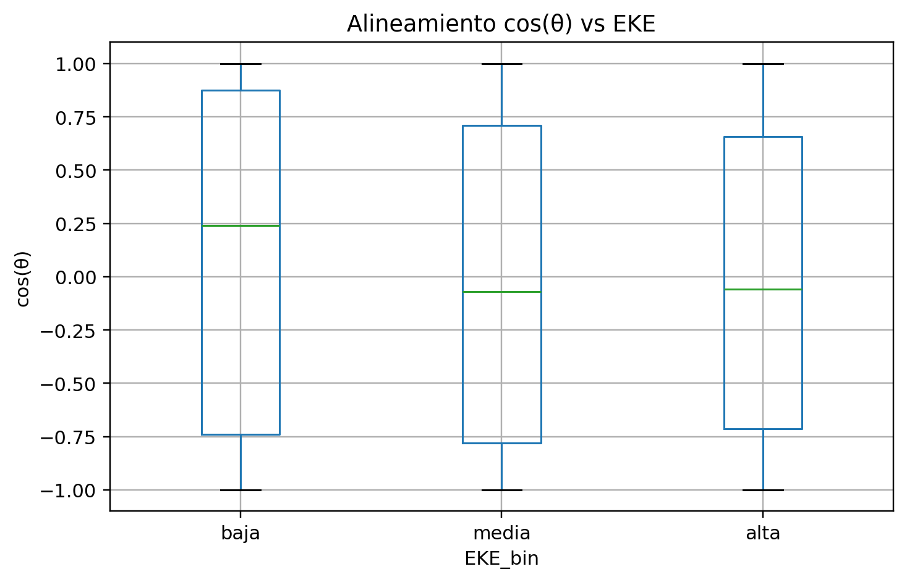
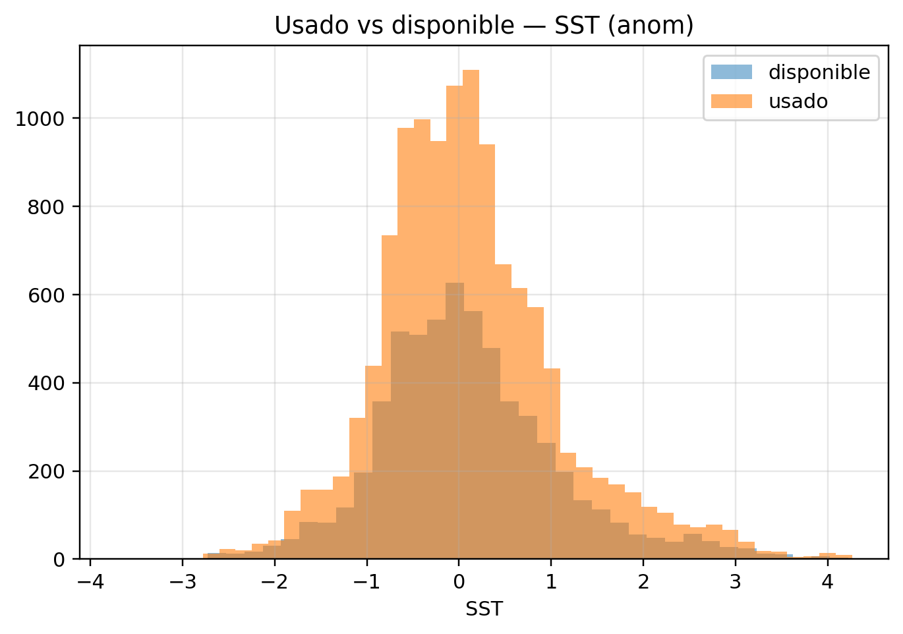
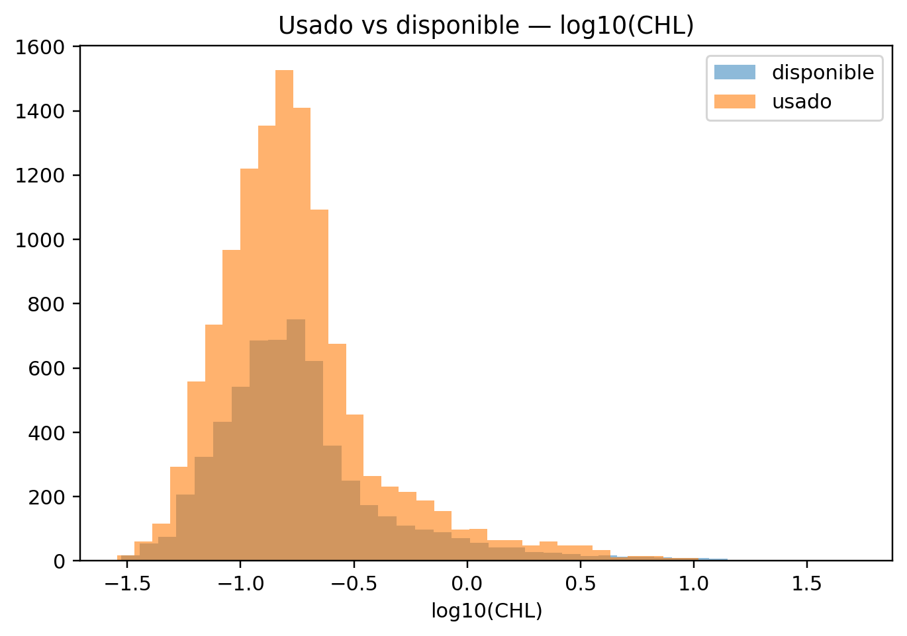
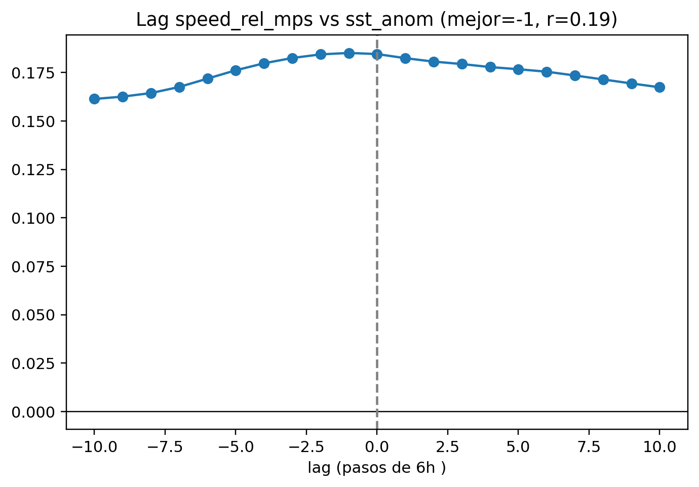
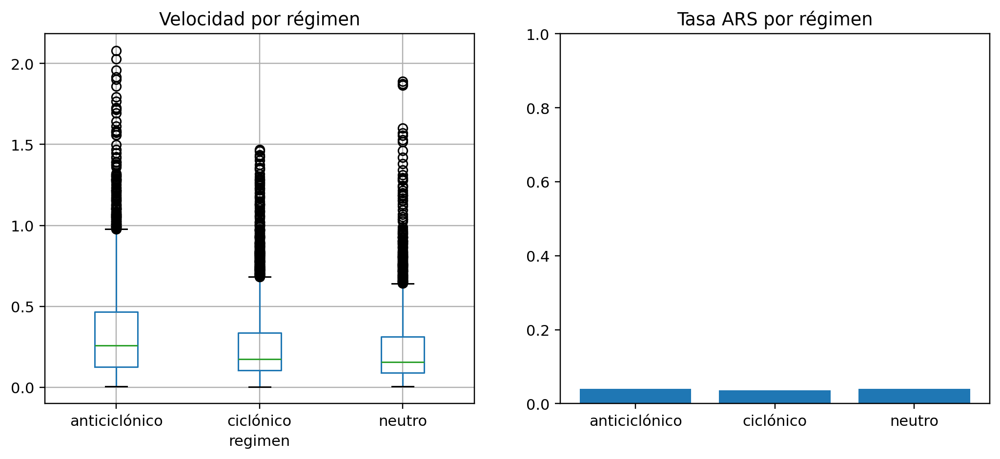
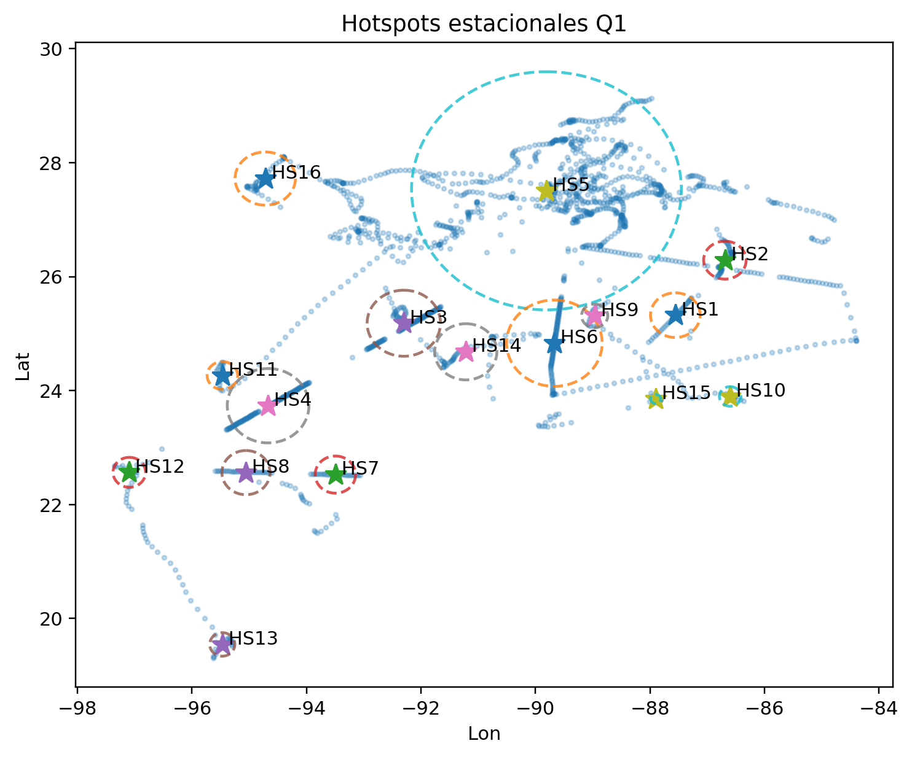
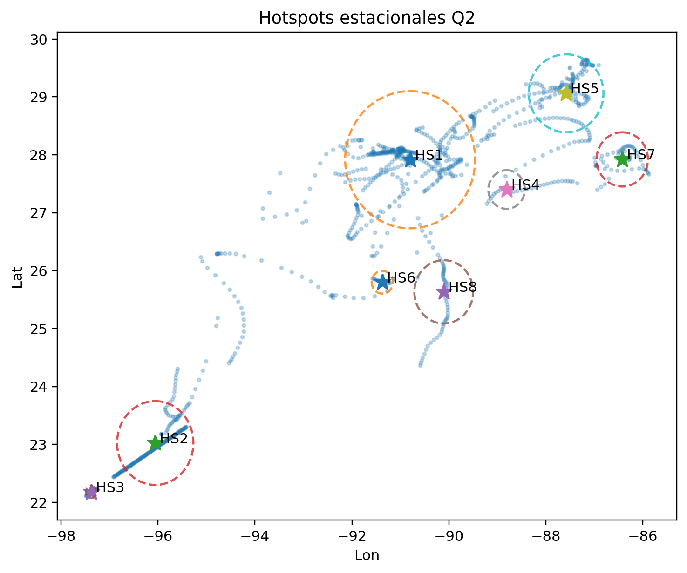
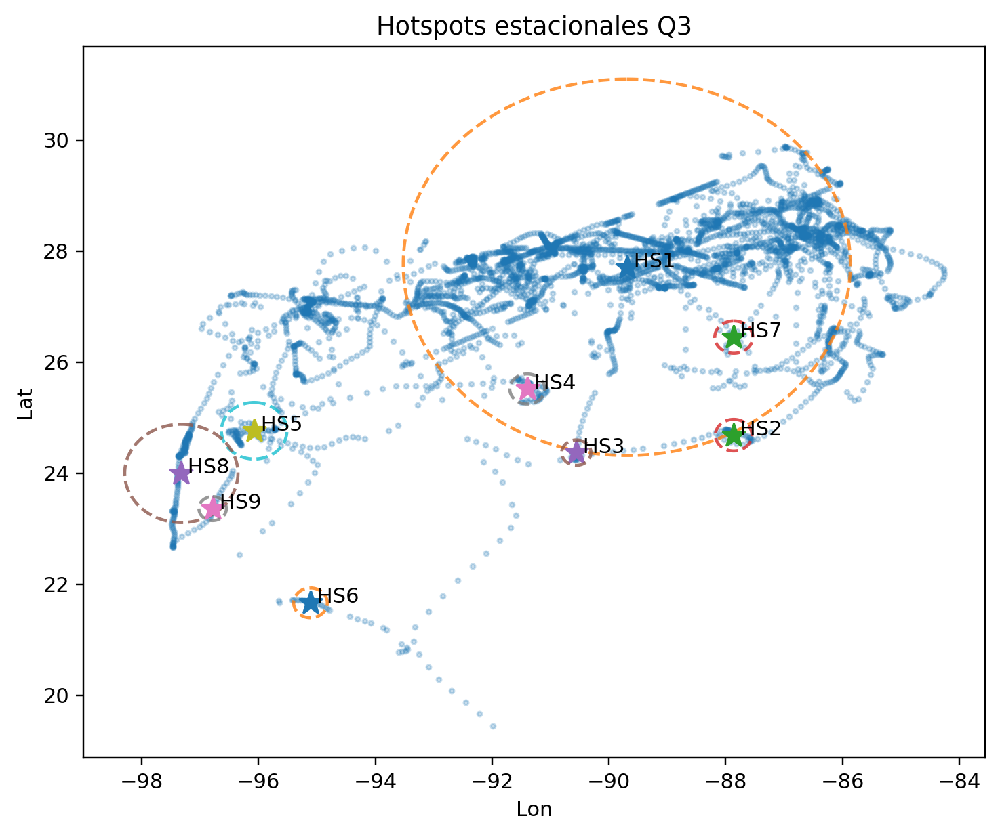
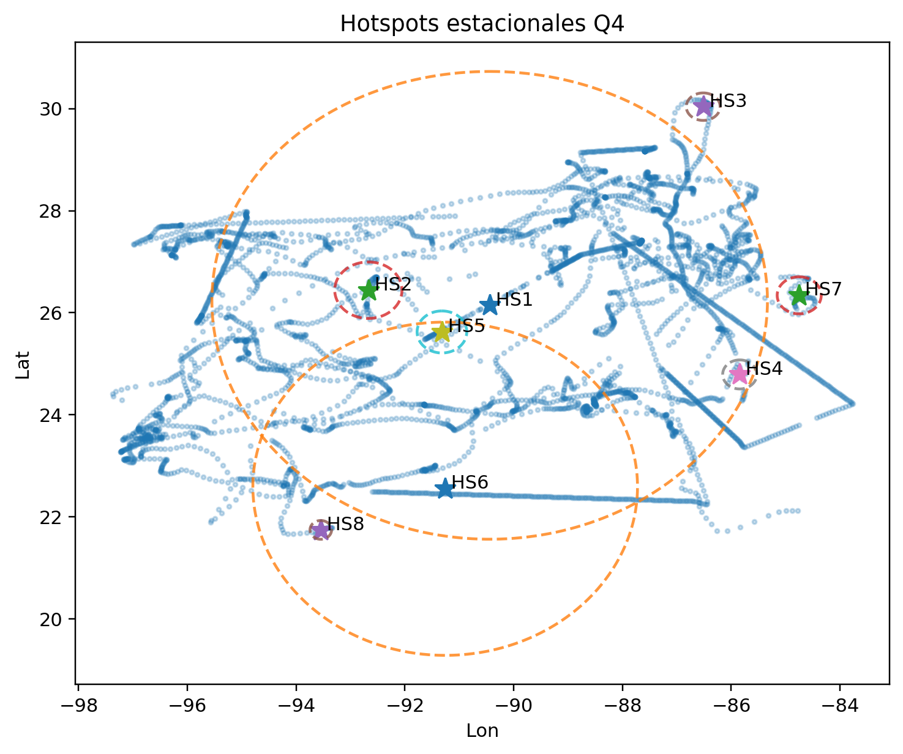

# Informe automático (Q&A ecológico)

## Q1

Q1: ver boxplot; resumen:
             mean       std       25%       50%       75%   count
EKE_bin                                                          
baja     0.089048  0.762888 -0.739085  0.239936  0.875853  3041.0
media   -0.035119  0.726311 -0.781116 -0.070040  0.709679  6080.0
alta    -0.033451  0.698947 -0.714054 -0.059718  0.658876  3040.0

Archivos:

- Q1_alignment_stats.csv

## Q2

Q2: KS p=0.875, Cliff’s Δ=0.00.

Archivos:

- Q2_sst_stats.csv

## Q3

Q3: KS p=0.0323, Cliff’s Δ=-0.01.

Archivos:

- Q3_chl_stats.csv

## Q4

Q4: mejor lag=-1 (r=0.19).

Archivos:

- Q4_lag_curve.csv

## Q5

Q5: velocidades y ARS varían por régimen (ver figura).

Archivos:

- Q5_speed_stats.csv

- Q5_ars_rate.csv

## Q6

Q6: hotspots estacionales generados por trimestre.

